<!-- 
SLUG: /guide-process 
-->

TITLE: Guide to the IETF standards process

<!-- 
INTRODUCTION
-->

The IETF follows open and well-documented processes for its work, including setting Internet standards. This guide synthesizes various sources to describe the IETF standards process at a high level.

<!-- 
BODY 
-->

* <a href="#overview">Overview</a> 
* <a href="#groups">Groups involved in the Standards process</a> 
        * <a href="#wgs">Working Groups</a> 
        * <a href="#directorates">Directorates and teams</a> 
        * <a href="#iesg">Internet Engineering Steering Group</a> 
* <a href="#flow">General process flow</a> 
* <a href="#diagram">Diagram of generalized IETF standards process</a> 
* <a href="#more">More information</a> 

The IETF standards process, related processes, and the groups that guide and oversee them are defined in [RFCs](https://www.ietf.org/process/rfcs/)—many of which are further codified as Best Current Practices ([BCPs](https://www.ietf.org/process/rfcs/#series-structure))—and statements by the Internet Engineering Steering Group ([IESG](https://www.ietf.org/about/groups/iesg/)). A complementary [Guide to IETF process documents](https://www.ietf.org/process/guide-process-documents/) provides a more in-depth review of the variety of documents that describe the IETF standards process, as well as related groups and processes.

This guide focuses on the process once ideas are determined to be within the scope of the IETF. The IETF also works on specifications that are within its scope but not Internet standards; his page includes some information about those to provide additional clarity about and context for its work on standards. 

# <a id="overview">Overview

The IETF standards process starts when an individual (or individuals) shares an idea, usually in the form of an Internet-Draft ([I-D](https://www.ietf.org/participate/ids/)) document, for further discussion within the IETF community. IETF participation is voluntary and there is no top-down plan that requires any particular topic to be worked on or idea to be adopted. For a more complete description of how new work may be undertaken in the IETF, see the [Bringing new work to the IETF webpage](https://www.ietf.org/process/new-work/).

[RFCs](https://www.ietf.org/process/rfcs/) are the core output of the IETF process. An IETF RFC is produced when, as determined by the Internet Engineering Steering Group ([IESG](https://www.ietf.org/about/groups/iesg/)), there is consensus that an I-D ought to be published in the IETF stream of the RFC document series. Not all RFCs are produced by the IETF and not the RFCs produced by IETF processes describe Internet Standards.

# <a id="groups">Groups involved in the Standards process

Below is a summary of groups involved in the IETF standards process. [RFC 9281](https://www.rfc-editor.org/rfc/rfc9281.html) provides a more complete description of these and other groups.

## <a id="wgs">Working Groups

The vast majority of the IETF's work is done in its many Working Groups, of which there are well over one hundred active at any time. A [dedicated guide to IETF Working Groups](https://www.ietf.org/process/wgs/) explains the basics of how they work, how to participate in one, and what to expect.

## <a id="directorates">Directorates and teams

[IETF Directorates](https://datatracker.ietf.org/dir/) (e.g. Transport Area Review Team, Security Area Directorate, General Area Review Team) provide review and advice to support Area Directors. These comprise experienced members of the IETF and the technical community represented by the Area. The specific name and the details of the role for each group differ from area to area, but the primary intent is that these groups assist the Area Director(s), e.g., with the review of specifications produced in the Area. However, they may also review other documents. For example the Security Area Directorate provides review of nearly all documents proposed to be published as RFCs.

## <a id="iesg">Internet Engineering Steering Group (IESG)

The [IESG](https://www.ietf.org/about/groups/iesg/) reviews and approves working group documents and candidates for the IETF standards track.The IESG ensures that the documents are of a sufficient quality to be published as RFCs: that they describe their subject matter well, and that there are no outstanding engineering issues that should be addressed before publication. The degree of review will vary with the intended status and perceived importance of the documents.

# <a id="flow">General process flow

The basic formal definition of the IETF standards process is [RFC 2026](https://www.rfc-editor.org/info/rfc2026/). It embodies and aims to achieve the IETF’s [mission](https://www.ietf.org/about/introduction/#mission) while adhering to its [principles](https://www.ietf.org/about/introduction/#principles), which include open processes, technical competence, and rough consensus and running code as described in RFC ([BCP 95](https://www.rfc-editor.org/info/bcp95), Since publication of RFC 2026, several more RFCs have been published adding to and amending the process; these are collected in [BCP 9](https://www.rfc-editor.org/info/bcp9/) (BCP stands for "Best Current Practice"). 

The intellectual property rules are now separate, in RFC 5378 ([BCP 78](https://www.rfc-editor.org/info/bcp78)) (rights in contributions) and RFC 8179 ([BCP 79](https://www.rfc-editor.org/info/bcp79)) (rights in technology).

While there are many paths an idea may take in the IETF, a general flow for many is this:

## Individual Phase

1. **Internet-Draft (I-D) Authoring**
   
   By writing an Internet-Draft, individual authors distill an idea or problem or need, and a proposed way forward or solution, into a format that it can be shared with others in the IETF community. Anyone can write an I-D and submit it to the IETF I-D repository. The I-D format is very useful because it is familiar to IETF participants and can easily progress to an RFC document. More information about the mechanics of authoring an I-D is available at [authors.ietf.org](http://authors.ietf.org).

   I-Ds may be considered in a variety of forums in the IETF. For details, see the ["Bringing new work to the IETF" webpage](https://www.ietf.org/process/new-work/#appropriate-part). Not all I-Ds gain enough traction to progress further within the IETF.

## Working Group Phase

Most I-Ds that do progress within the IETF do so within a Working Group. Once an I-D has been introduced to and discussed within a working group, it generally follows these steps:

2. **Working Group Call for Adoption**  
   After initial discussion in the Working Group (WG), if there seems to be interest and energy the chairs will send a message to the WG mailing list asking WG participants to indicate whether or not they think I-D ought to be formally worked on by the group. This "Call for Adoption" usually takes place over two weeks. If, at the end of the period, the chairs determine there is enough interest and energy, then they declare the I-D to be adopoted.
   
   The name of the I-D will be changed at this point to reflect the adopting WG and sets the stage for further consideration within the WG. The chairs may also assign an author (or authors) for the I-D different from the initial author. The WG chairs generally also assign a person as a "document shepherd", who makes sure an I-D continues to progress appropriately through the IETF processes, keeping in mind the overall IETF goal of producing technically excellent documents.

4. **Working Group Discussion**  
   After an I-D is adopted by a WG, it will be discussed on the group’s mailing list, during WG interim meetings, and as part of the WG sessions at IETF Meetings. The goal of this step, which usually takes place over months, is to clarify and improve the document text so that it clearly describes a) the issue or problem to be addressed, and b) the proposed solution so that implementers can successfully build off of it. The text of an I-D is often updated many times over the course of WG consideration. When the WG Chairs believe a document is ready, with all of the points addressed, they will then initiate Working Group Last Call.

6. **Working Group Last Call (WGLC)**  
   WG Chairs formally initiate this step by sending an email to the WG mailing list with a date by which all comments should be received. The goal of WGLC is to understand whether or not a document has rough consensus among WG participants (as judged by the WG Chairs) to progress to the next step of publication as an RFC. After review, the chairs may decide that a document does not have consensus in its current form, in which case it usually will be subject to further discussion in the WG, and another WGLC will be held. If the WG chairs decide an I-D does have consensus, then it will be submitted to the AD responsible for publication as an RFC.

## IESG Phase

7. **Area Director (AD) Evaluation**  
   In this step, the responsible AD reviews the document with an aim of making sure it is ready for an IETF-wide Last Call (LC). The authors should reply to any comments or questions, but replies from others in the WG are also welcome. If major issues are found, a document's progress will be blocked until they are dealt with, which may require a new version of the I-D.

8. **IETF Last Call**  
   Once the AD thinks an I-D is ready, they will initiate and announce by email to a broad cross section of the IETF community an IETF-wide Last Call (IETF LC) with a specific date by which to provide comments. Several directorate reviews (such as Security) are also requested; the particular directorates depend on the topic of the I-D. At this stage reviews are usually not experts in the document’s topic, and come in with fresh eyes. IETF LC usually raises issues that require a new version of the I-D to address.

9. **Submitted for IESG Review**  
   Once the issues raised during IETF LC are addressed, the responsible AD will initiate IESG review. The goal of this stage is to prepare for and provide input to the formal IESG evaluation, which happens during the regularly scheduled IESG telechats.

10. **IESG Evaluation and Telechat**  
   At this step, the IESG discusses an I-D, both in the IETF Datatracker and on a regularly scheduled teleconference (“telechat”) to decide whether or not it should be published as an RFC. They may raise questions at this time that can be addressed in a variety of ways, including by either sending the document back to a WG or, if it is a minor change, requesting a revision of the I-D by the author. For an I-D intended to be a Standards Track RFC, approval for publication requires “Yes” or “No objection” ballots from two-thirds of voting ADs. Informational Track RFC publication only requires a single “Yes” AD ballot position. An I-D does not proceed to publication if any AD submits a “Discuss” ballot position.

11. **IESG Approval**  
   Once the document has been on a telechat, any necessary revised versions have been posted, and all DISCUSS positions are "cleared", the Responsible AD (or the IESG Secretary) will follow-up with any final changes or checks are needed. Once those are complete, the docoument is approved for publication as an RFC. At this point, the document is handed over to the [RFC Editor](https://www.rfc-editor.org), which edits, publishes, and archives RFCs.

13. **Publication as an RFC**  
   Once IESG approves an I-D for publication, the document is handed over to the RFC Editor for publication. At this stage, the RFC Publication Center (RPC) does a thorough editorial review to be sure the I-D is clear and comports with RFC Series editorial guidelines and style. Authors may be asked for clarification on specific points and will, during the phase called “AUTH48” be asked about specific changes the RPC wants to make. Once AUTH48 is complete, the I-D is officially published as an RFC by the RFC Editor.

```mermaid
graph TD
    %% Individual Phase
    Start([Idea / New Work]) --> ID[Write Internet-Draft]
    ID --> Submission[Submit to Datatracker]
    
    %% WG Phase
    Submission --> WG_Choice{Working Group?}
    WG_Choice -- "Yes" --> WG_Adoption[WG Adoption Call]
    WG_Choice -- "No" --> Individual[Individual Submission]
    
    WG_Adoption --> WG_Draft[Working Group Draft]
    WG_Draft --> Iteration[Discussion & Iteration]
    Iteration --> WGLC[Working Group Last Call - WGLC]
    
    %% IESG Review Phase
    WGLC --> AD_Review[Area Director - AD - Review]
    Individual --> AD_Review
    
    AD_Review --> IETF_LC[IETF Last Call]
    IETF_LC --> IESG_Eval[IESG Evaluation / Ballot]
    
    %% Outcomes
    IESG_Eval --> Approved{Approved?}
    Approved -- "No" --> Iteration
    Approved -- "Yes" --> RPC[RFC Production Center]
    
    %% Publication Phase
    RPC --> Auth48[AUTH48 - Author Final Review]
    Auth48 --> RFC_Published[[RFC Published]]
    
    %% Styling
    style Start fill:#f95428,stroke:#f95428,stroke-width:2px
    style RFC_Published fill:#002d3c,stroke:#0b8cc5,stroke-width:2px
    style WG_Draft fill:#02a1d7,stroke:#0b8cc5
    style IESG_Eval fill:#3e95c8,stroke:#0b8cc5
```

# <a id="diagram">Diagram of generalized IETF standards process

# <a id="more">More information

[Internet-Drafts](https://www.ietf.org/participate/ids/)

[Working Groups](https://www.ietf.org/process/wgs/)

[Open records](https://www.ietf.org/about/open-records/) 

[Intellectual property rights](https://www.ietf.org/process/ipr/)

[Mailing lists](https://www.ietf.org/participate/lists/)

[Meetings](https://www.ietf.org/meeting/guide-ietf-meetings/)
