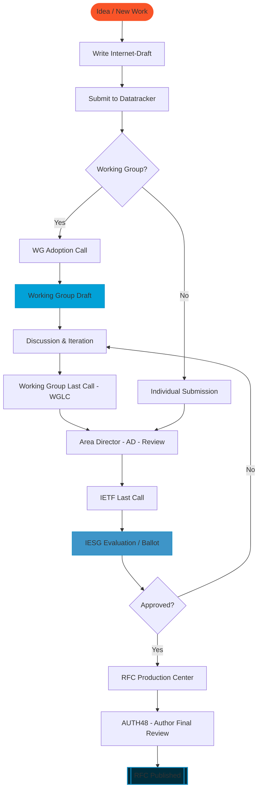

# Diagram of generalized IETF standards process

<!-- This is diagram will not render in Wagtail as of 2026-08-25 so should not be applied to www.ietf.org until an update
-->

```mermaid
graph TD
    %% Individual Phase
    Start([Idea / New Work]) --> ID[Write Internet-Draft]
    ID --> Submission[Submit to Datatracker]
    
    %% WG Phase
    Submission --> WG_Choice{Working Group?}
    WG_Choice -- "Yes" --> WG_Adoption[WG Adoption Call]
    WG_Choice -- "No" --> Individual[Individual Submission]
    
    WG_Adoption --> WG_Draft[Working Group Draft]
    WG_Draft --> Iteration[Discussion & Iteration]
    Iteration --> WGLC[Working Group Last Call - WGLC]
    
    %% IESG Review Phase
    WGLC --> AD_Review[Area Director - AD - Review]
    Individual --> AD_Review
    
    AD_Review --> IETF_LC[IETF Last Call]
    IETF_LC --> IESG_Eval[IESG Evaluation / Ballot]
    
    %% Outcomes
    IESG_Eval --> Approved{Approved?}
    Approved -- "No" --> Iteration
    Approved -- "Yes" --> RPC[RFC Production Center]
    
    %% Publication Phase
    RPC --> Auth48[AUTH48 - Author Final Review]
    Auth48 --> RFC_Published[[RFC Published]]
    
    %% Styling
    style Start fill:#f95428,stroke:#f95428,stroke-width:2px
    style RFC_Published fill:#002d3c,stroke:#0b8cc5,stroke-width:2px
    style WG_Draft fill:#02a1d7,stroke:#0b8cc5
    style IESG_Eval fill:#3e95c8,stroke:#0b8cc5
```
